# Tableau-Viz-Projects
## Overview
Data Analysis and Visualization on various datasets were done using Tableau. Dashboards and Stories were built using Tableau to communicate the insights from data.
These visualization projects are done based on first 4 courses in Tableau specialization on Coursera. Datasets which are analyzed and used viz can be found in Datasets folder and Visualization assignments of this course can be found in Assignments folder. All Visulizations can be found at my Tableau profile.

## Tableau profile and viz links
#### Overall Tableau profile:
Overall profile: https://public.tableau.com/profile/rohith.kumar.poshala#!/

#### Data Visualization projects with dashboards and stories built using Tableau

Story Point Presentation of Sales Super Store dataset: [t.ly/4Ttu](t.ly/4Ttu)   
Dashboard for Sales SuperStore Dataset: https://public.tableau.com/profile/rohith.kumar.poshala#!/vizhome/DashboardforSalesSuperStoreDataset/Dashboard1   
KPI workshop: https://public.tableau.com/profile/rohith.kumar.poshala#!/vizhome/KPIworkshop/Dashboard1   
Dual Layer Maps Assignment: t.ly/1YBB   
Maps_workshop: https://public.tableau.com/profile/rohith.kumar.poshala#!/vizhome/Maps_workshop/Dashboard1   
ChocoBar Visualization: t.ly/09Dr   
Sales Spotlight Product View: t.ly/2Uk4   
Shipping Tool: https://public.tableau.com/profile/rohith.kumar.poshala#!/vizhome/ShippingTool/ShippingDetails   
Customer Scatterplot: t.ly/15U7   
Worst 3 performing sub categories by region in Sales dataset: t.ly/mq3o   
Control Chart on SuperStore dataset: https://public.tableau.com/profile/rohith.kumar.poshala#!/vizhome/ControlChartonSuperStoredataset/Sheet1   
Workbook-of-Anscombe_s-Quartet: t.ly/di41   
Dashboard for SuperStore Sales: https://public.tableau.com/profile/rohith.kumar.poshala#!/vizhome/DashboardforSuperStoreSales/Dashboard1   
Pre-attentive attribute exploration: t.ly/lI7e   
USDA decluttering workbook2 - bar graph: https://public.tableau.com/profile/rohith.kumar.poshala#!/vizhome/USDAdeclutteringworkbook2-bargraph/bargraph   
USDA decluttering workbook: https://public.tableau.com/profile/rohith.kumar.poshala#!/vizhome/USDAdeclutteringworkbook/bubble   
Viz_workshop: https://public.tableau.com/profile/rohith.kumar.poshala#!/vizhome/Viz_workshop_16088540304100/Viz_workshop   

## Below are few examples of Viz done for this project:

Story Point Presentation of Sales Super Store dataset: 
First Dashboard in the Story:
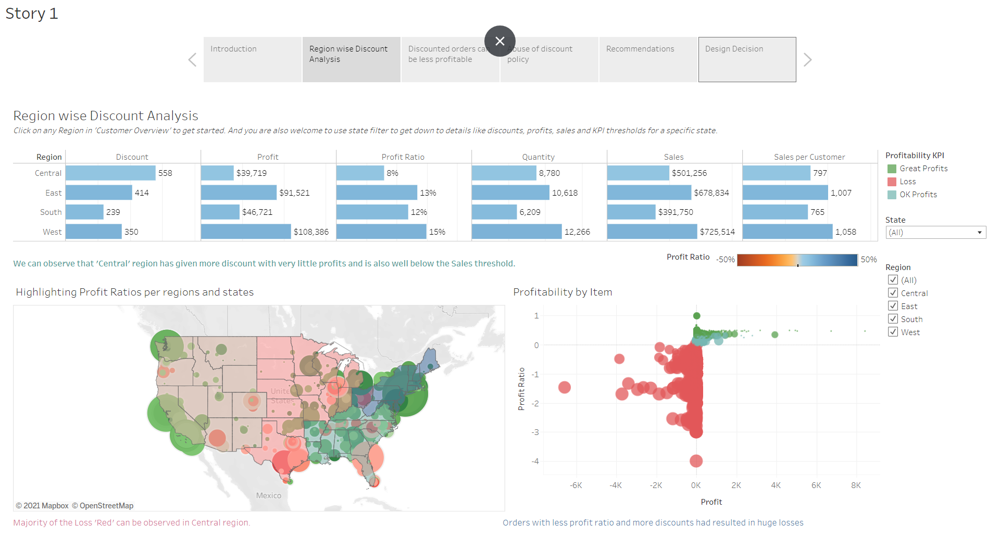

Region specific on above dashboard:
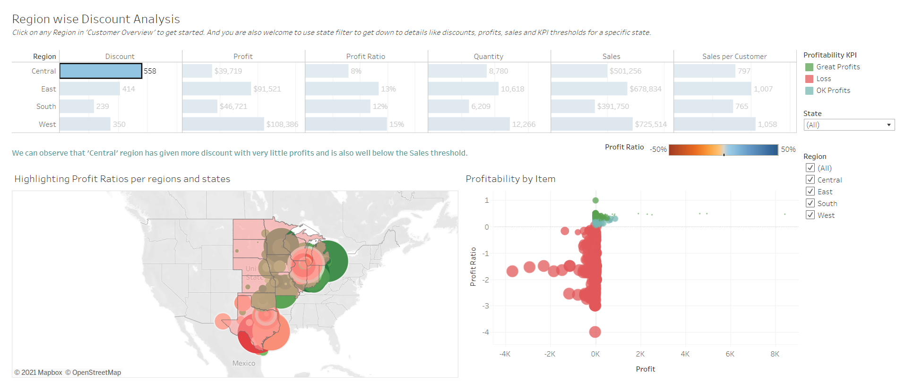

Another Dashboard in the Story:
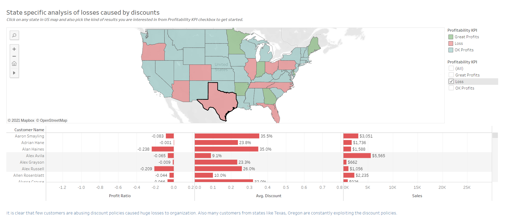

State specific on above dashboard:
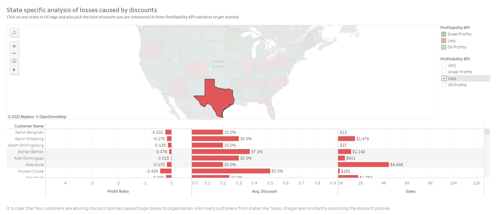

ChocoBar Visualization: 
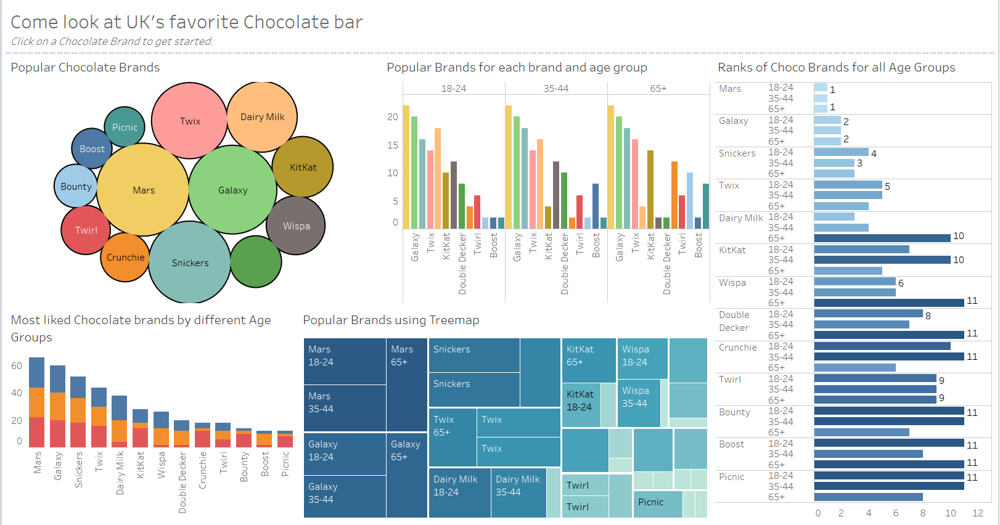
Brand Specific viz of above dashboard:
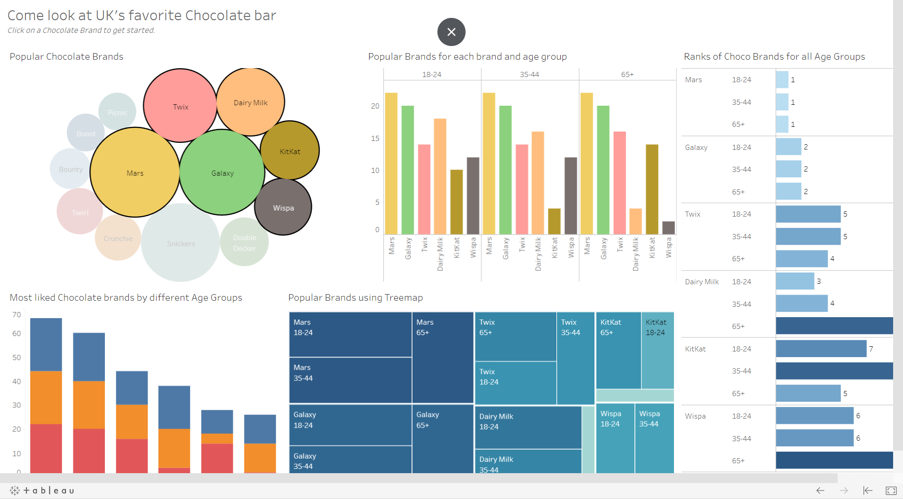

KPI workshop: 
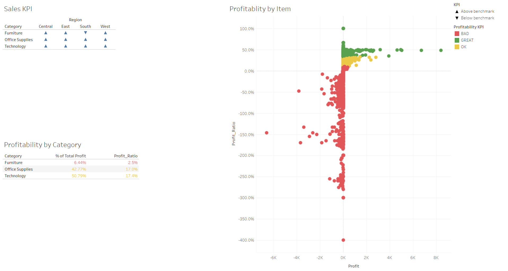
Dual Layer Maps Assignment: 
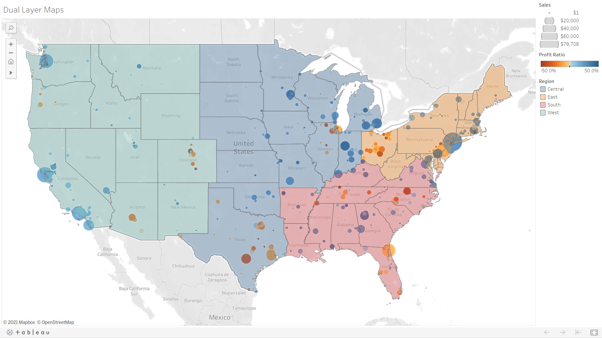
Maps_workshop: 
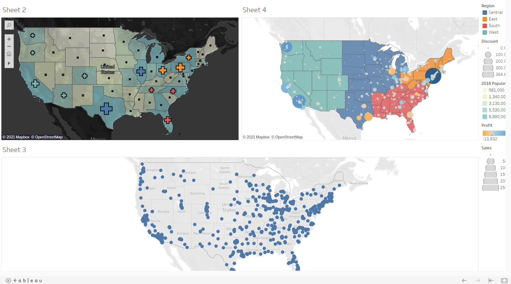

Sales Spotlight Product View: 
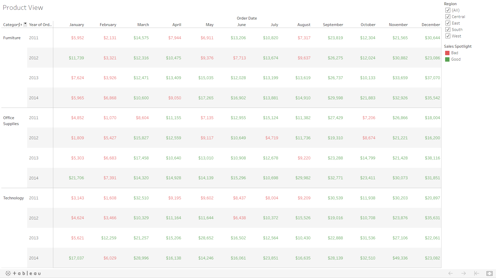
Customer Scatterplot: 
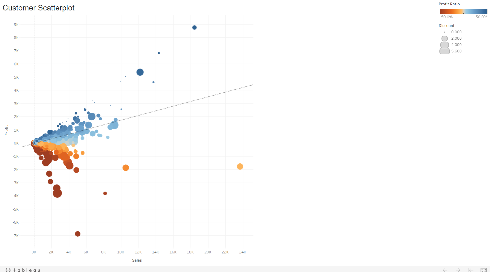
Worst 3 performing sub categories by region in Sales dataset: 
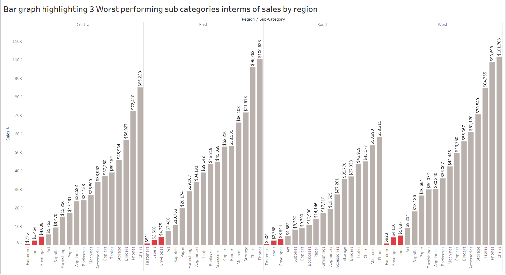
